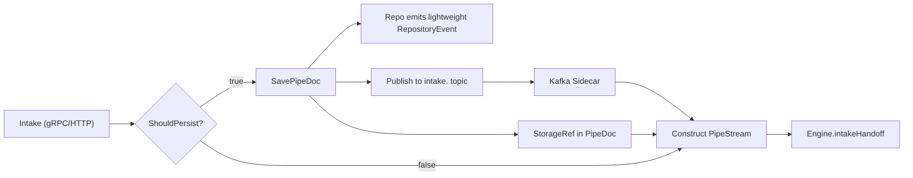

# Connector Intake Service - Hydration Strategy Design

## Overview

This document defines the **config-driven hydration strategy** for `connector-intake-service`. The service acts as the **decision coordinator** for persistence, applying policies from datasource configuration to determine when to persist documents vs. pass them through directly to the engine.

> **Naming Note**: This document refers to `datasource-admin` for the service that manages connectors and datasources. In the codebase, this service is named `connector-admin`. They are the **same service** - see `DESIGN-SERVICE-RESPONSIBILITIES.md` for details.

## Core Principle: Intake Coordinates

**connector-intake-service is the decision maker**. It is not a dumb proxy; it applies the "Ingest Policy" (Save vs. Pass-through) based on datasource configuration.

- **Repository Service**: Utility called when persistence is required, ignored when not
- **Engine**: Processor that receives PipeDoc; agnostic to whether it has `blob.data` (inline) or `blob.storage_ref` (S3)

### Event and Handoff Boundary

- Intake should not subscribe to all module-level execution events.
- For normal ingestion we use the existing event and transport model:
  - Intake decides persistence policy.
  - Persisted docs use repo save + intake topic -> sidecar -> `intakeHandoff`.
  - Non-persisted/gRPC inline docs go direct to `intakeHandoff`.
- `RepositoryEvent` remains the canonical repository event for indexing and reconciliation.
- Pipeline fan-in/fan-out step events are not required for intake orchestration in this phase.



## Ownership / ACL Enrichment (Planned)

We should keep this as a **generic, protocol-first intake boundary**:
- Add an intake-owned, pluggable gRPC enrichment service.
- Keep contract identifier-based and connector-agnostic.
- Use this as an insertion point before building the final `PipeStream`.

Proposed proto shape:

```protobuf
service OwnershipContextService {
  rpc ResolveOwnershipContext(ResolveOwnershipContextRequest) returns (ResolveOwnershipContextResponse);
}

message ResolveOwnershipContextRequest {
  string doc_id = 1;
  string account_id = 2;
  string datasource_id = 3;
  optional string connector_id = 4;
  optional string graph_address_id = 5;
  optional string checksum = 6;
  optional string version_id = 7;
}

message ResolveOwnershipContextResponse {
  OwnershipContext ownership_context = 1;
}

message OwnershipContext {
  string owner_principal = 1;
  repeated string acl_principals = 2;
  map<string, string> metadata_hints = 3;
  string requested_collection = 4;
}
```

Guidance:
- Implement first connector-specific enrichment in Java inside intake.
- Keep `ownership_context` as a generic, reusable proto contract so future connector integrations can plug in without schema churn.
- At this stage, no new Kafka events are required for the enrichment call.

### Builder/Message Assembly Note

- You can keep a mutable `PipeDoc.Builder` during intake orchestration and enrich in memory before final handoff.
- gRPC and Kafka carry immutable protobuf messages; the finalized `PipeDoc` should still be built once per hop for each outbound call.
- This is exactly the correct pattern for chained enrichment inside intake.

## Hydration Strategy: Config-Driven

### Source of Configuration

- **Source**: 2-Tier Configuration Architecture (details below)
- **Decision Point**: `connector-intake-service` (uses Tier 1 config only)
- **Logic**:
  - "Should I persist raw input to S3?" (Resolved from Tier 1 config only)
  - Engine handles Tier 2 config merging and routing during IntakeHandoff
  - "Should I persist processed outputs?" (Defined per-Node in Tier 2 config, handled by engine)
  - Routing and output hints (Tier 2 per-node configuration, handled by engine)

### Configuration Architecture: 2-Tier Model

The connector configuration system follows a **2-tier model** similar to the module system, but adapted for connector/datasource needs:

#### Universal vs. Connector-Specific Configuration

**Universal Configuration** (applies to ALL connectors):
- **PersistenceConfig**: When to persist documents (persist_pipedoc, max_inline_size_bytes)
- **RetentionConfig**: How long to keep documents (policy, retention_days, max_versions)
- **EncryptionConfig**: Encryption settings (encryption_type, kms_key_id, client_provided_key)
- **HydrationConfig**: Hydration/dehydration policies (hydration_policy, drop_blobs_after_parse, etc.)

**Connector-Specific Configuration** (defined via JSON Schema in `custom_config`):
- Each connector type defines its own JSON Schema for connector-specific options
- Examples: Web Crawler (URLs, crawl settings), S3 (prefix patterns), Wikipedia (parse options)

#### Example: 3 Connector Types - Tier 1 vs. Tier 2 Breakdown

| Configuration Category | Wikipedia Connector | S3 Connector | Web Crawler Connector |
|------------------------|---------------------|--------------|----------------------|
| **TIER 1: Universal (Strongly Typed)** |
| `persistence_config` | persist_pipedoc: true<br/>max_inline_size: 1MB | persist_pipedoc: true<br/>max_inline_size: 10MB | persist_pipedoc: true<br/>max_inline_size: 5MB |
| `retention_config` | policy: INDEFINITE<br/>retention_days: -1 | policy: TIME_BASED<br/>retention_days: 365 | policy: TIME_BASED<br/>retention_days: 90 |
| `encryption_config` | encryption_type: KMS<br/>kms_key_id: "..." | encryption_type: CLIENT_PROVIDED<br/>key_reference_id: "..." | encryption_type: SERVER_SIDE |
| `hydration_config` | hydration_policy: AUTO<br/>drop_blobs_after_parse: true | hydration_policy: ALWAYS_REF<br/>drop_blobs_after_parse: false | hydration_policy: AUTO<br/>drop_blobs_after_parse: true |
| **TIER 1: Connector-Specific (JSON Schema)** |
| `custom_config` | {<br/>  "parse_images": true,<br/>  "include_history_metadata": true,<br/>  "extract_urls": true,<br/>  "crawl_depth": 3,<br/>  "rate_limit_per_second": 5<br/>} | {<br/>  "prefix_patterns": ["documents/", "archive/"],<br/>  "include_patterns": ["*.pdf", "*.docx"],<br/>  "exclude_patterns": ["*.tmp", "*.log"],<br/>  "bucket_region": "us-east-1"<br/>} | {<br/>  "base_url": "https://example.com",<br/>  "failure_allowance": 10,<br/>  "crawl_frequency": "daily",<br/>  "follow_redirects": true,<br/>  "parse_images": false,<br/>  "respect_robots_txt": true<br/>} |
| **TIER 2: Universal (Strongly Typed Overrides)** |
| `persistence_config` (override) | Optional: Override for specific graph node | Optional: Override for specific graph node | Optional: Override for specific graph node |
| `retention_config` (override) | Optional: Node-specific retention | Optional: Node-specific retention | Optional: Node-specific retention |
| `hydration_config` (override) | Optional: Node-specific hydration | Optional: Node-specific hydration | Optional: Node-specific hydration |
| `output_hints` | desired_collection: "wikipedia-articles"<br/>routing_hints: {...} | desired_collection: "s3-documents"<br/>routing_hints: {...} | desired_collection: "web-content"<br/>routing_hints: {...} |
| **TIER 2: Node-Specific (JSON Schema)** |
| `custom_config` | {<br/>  "indexing_node_specific_option": "value",<br/>  "custom_metadata_field": "..."<br/>} | {<br/>  "node_specific_filter": "...",<br/>  "processing_override": "..."<br/>} | {<br/>  "node_crawl_override": "...",<br/>  "content_filter": "..."<br/>} |

**Key Insights:**
- **Tier 1 Universal**: Same strongly typed fields for all connectors (persistence, retention, encryption, hydration)
- **Tier 1 Custom**: Connector-specific JSON config defines what makes each connector unique (URLs for web crawler, bucket patterns for S3, parse options for Wikipedia)
- **Tier 2 Universal**: Output hints and optional overrides of Tier 1 universal config
- **Tier 2 Custom**: Node-specific connector options (e.g., "only parse images in this node", "different crawl settings for this node")

#### Strongly Typed Configuration Fields (gRPC)

The following configuration categories are **strongly typed** in protobuf (NOT JSON Schema):

1. **PersistenceConfig**: When to persist documents to object storage
   - `persist_pipedoc` - Should gRPC uploads be persisted?
   - `max_inline_size_bytes` - Max size before forcing persistence

2. **RetentionConfig**: How long to keep documents
   - Retention policy (indefinite, time-based, version-based, no retention)
   - Retention days (if time-based)
   - Max versions (if version-based)

3. **EncryptionConfig**: Encryption settings
   - Encryption type (none, server-side, KMS, client-side)
   - KMS key ID (if applicable)

4. **StorageConfig**: NOT part of datasource config - handled by repository-service via Drive entity
   - **Drive entity** is managed by `repository-service` (FilesystemService), NOT connector-admin
   - **Drive CRUD operations are already available** via `FilesystemService`:
     - `CreateDrive`, `UpdateDrive`, `GetDrive`, `ListDrives`, `DeleteDrive`
   - **DataSource entity** in datasource-admin only has `drive_name` (string reference)
   - **Drive configuration** (stored in repository-service) includes:
     - `bucket_name`, `region` - S3 bucket details
     - `credentials_ref` - Reference to credentials in Infisical
     - `kms_encryption` - KMS encryption configuration
     - `s3_credentials` - S3 credentials (stored in Infisical)
     - `bucket_config` - Bucket configuration (versioning, lifecycle, etc.)
   - This keeps storage implementation details (S3, MinIO, credentials, encryption) abstracted from datasource configuration
   - Datasource just references the drive by name; all storage config is managed by repository-service
   - **No new Drive CRUD needed** - already exposed via repository-service's FilesystemService

5. **HydrationConfig**: Hydration/dehydration policies for blob handling
   - Default hydration policy (always inline, always ref, auto, on-demand)
   - Drop blobs after parsing
   - Keep blobs as ref
   - Max inline blob size
   - Allow inline blobs for parser chains

#### Custom Configuration (JSON Schema)

Only connector-specific configuration uses JSON Schema validation via the `custom_config` field:

- **Examples**: Wikipedia connector might have `parse_images`, `include_history_metadata`, `extract_urls`
- **Examples**: S3 connector might have `prefix_patterns`, `include_patterns`, `exclude_patterns`
- **Examples**: File system connector might have `watch_directories`, `follow_symlinks`
- Each connector type defines its own JSON Schema for `custom_config`

#### Tier 1: Global/Default (Connector-Level)

**Location**: `Connector` entity in `datasource-admin` service (renamed from connector-admin)

**Purpose**: Default configuration for a connector type, applied to all datasource instances unless overridden.

**Storage**:
- Strongly typed fields stored directly on `Connector` entity (for known config like persistence, retention, encryption)
- `connectors.custom_config_schema` (JSONB) - JSON Schema **only** for custom/connector-specific configuration
- `connectors.default_custom_config` (JSONB) - Default values for custom config
- Stored in `connector_config_schemas` table (similar to module `config_schemas`)

**Configuration Types**:
- **Strongly Typed (gRPC)**: Known configuration fields (persistence, retention, encryption) are strongly typed in protobuf
- **JSON Schema**: Only custom/connector-specific configuration uses JSON Schema validation

**Examples (Strongly Typed)**:
- Default persistence policy (`persist_pipedoc = true`)
- Default retention policies (time-based, version-based)
- Default encryption settings (SSE-S3, SSE-KMS, SSE-C with client-provided keys)
- Default hydration policies (when to hydrate/dehydrate blobs)
- Rate limits (already in DataSource entity)
- File size limits (already in DataSource entity)

**Note**: Storage configuration (bucket, credentials, provider, versioning, lifecycle) is **NOT** in datasource config. It's managed internally via the `Drive` entity. Datasource only references `drive_name`.

**Examples (Custom/JSON Schema - Connector-Specific)**:
- **Wikipedia connector**: `parse_images`, `include_history_metadata`, `extract_urls`, `crawl_depth`
- **S3 connector**: `bucket_region`, `prefix_patterns`, `include_patterns`, `exclude_patterns`
- **File system connector**: `watch_directories`, `follow_symlinks`, `ignore_hidden_files`
- **Database connector**: `table_include_list`, `column_exclude_list`, `incremental_key_field`
- Any configuration unique to a connector type that isn't part of the core schema
- Note: Storage provider details (bucket name, credentials) are stored separately via Drive entity

#### Tier 2: Per-Node/Instance (DatasourceInstance-Level)

**Location**: `DatasourceInstance` in graph configuration (stored alongside nodes/edges)

**Purpose**: Node-specific configuration overrides and hints for pipeline routing and processing.

**Storage**:
- Graph configuration (engine-managed)
- `DatasourceInstance.node_config` - Per-node config values (strongly typed + custom JSON)

**Configuration Types**:
- **Strongly Typed (gRPC)**: Known fields like `desired_collection`, persistence overrides, routing hints
- **JSON Schema**: Only custom/connector-specific node configuration uses JSON Schema validation

**Examples (Strongly Typed)**:
- `desired_collection` - OpenSearch collection/index hint for this node
- Node-specific persistence rules (override Tier 1)
- Routing hints for downstream modules
- Node-specific retention policies
- Output destination configuration

**Examples (Custom/JSON Schema)**:
- Node-specific connector customizations
- Graph-specific routing rules
- Any node-level configuration unique to a connector type

#### Configuration Resolution Flow

When a document is ingested via `connector-intake-service`:

```
1. Load Connector entity (Tier 1 defaults)
   └─> Strongly typed defaults + custom_config_schema + default_custom_config

2. Load DataSource entity (Tier 1 instance overrides)
   └─> Strongly typed overrides + custom_config (overrides connector defaults)

3. Intake applies Tier 1 config:
   └─> Persistence decision (based on Tier 1 persistence_config only)
   └─> Forward to engine with Tier 1 IngestionConfig

4. Engine resolves Tier 2 config (during IntakeHandoff):
   └─> Find DatasourceInstance(s) for datasource_id in active graphs
   └─> Merge Tier 2 (from node_config) into Tier 1 IngestionConfig
   └─> Route to entry_node_id(s) from DatasourceInstance(s)
```

**Configuration Merging Rules** (applied by engine during IntakeHandoff):
- Tier 2 values override Tier 1 values (replacement, not deep merge)
- `custom_config` from Tier 2 REPLACES Tier 1 (no JSON merge - this keeps behavior predictable)
- `hydration_config` and `output_hints` from Tier 2 override Tier 1 when present

**Note**: Intake only uses Tier 1 config for persistence decisions. Engine merges Tier 2 when routing documents.

#### Registration Pattern (Similar to Modules)

Connectors follow a registration pattern similar to modules:

1. **Connector Registration**:
   - Connector type registers with `ConnectorRegistrationService`
   - Provides `custom_config_schema` (JSON Schema **only** for custom/connector-specific config)
   - Provides `node_custom_config_schema` (JSON Schema **only** for custom node-level config)
   - Known configuration fields (persistence, retention, etc.) are strongly typed in protobuf
   - Frontend uses JSON Forms with schemas to generate UI for **custom config only**
   - Stored in `connector_config_schemas` table

2. **Key Differences from Modules**:
   - **No processing**: Connectors don't implement `ProcessData` RPC
   - **2-tier instead of 1-tier**: Global defaults + per-node configs
   - **Graph-bound**: Tier 2 configs are graph-versioned (stored with graph)
   - **Ingestion-focused**: Configuration drives intake behavior and routing hints
   - **Hybrid typing**: Strongly typed protobuf for known fields, JSON Schema only for custom fields

### Configuration Fields (2-Tier Model)

#### Shared Types (Core Types)

**Location**: `pipestream-protos/common/proto/ai/pipestream/data/v1/pipeline_core_types.proto`

These types are shared across services and used in per-stream configuration:

```protobuf
// Mode indicating how a document entered the ingestion pipeline.
enum IngressMode {
  INGRESS_MODE_UNSPECIFIED = 0;
  INGRESS_MODE_HTTP_STAGED = 1;   // Persisted to S3 via HTTP upload or gRPC with persistence
  INGRESS_MODE_GRPC_INLINE = 2;   // Passed inline via gRPC without persistence
}

// Configuration for hydration/dehydration policies for blob handling.
message HydrationConfig {
  HydrationPolicy default_hydration_policy = 1;
  bool drop_blobs_after_parse = 2;
  bool keep_blobs_as_ref = 3;
  int32 max_inline_blob_size_bytes = 4;
  bool allow_inline_blobs_for_parser_chains = 5;

  enum HydrationPolicy {
    HYDRATION_POLICY_UNSPECIFIED = 0;
    HYDRATION_POLICY_ALWAYS_INLINE = 1;
    HYDRATION_POLICY_ALWAYS_REF = 2;
    HYDRATION_POLICY_AUTO = 3;
    HYDRATION_POLICY_ON_DEMAND = 4;
  }
}

// Output hints for downstream processing and routing.
message OutputHints {
  string desired_collection = 1;        // OpenSearch collection/index hint
  map<string, string> routing_hints = 2; // Routing hints for downstream modules
}

// Ingestion configuration passed from intake to engine.
// Intake sets Tier 1 values; Engine merges Tier 2 overrides during IntakeHandoff.
message IngestionConfig {
  IngressMode ingress_mode = 1;              // Set by intake (HTTP_STAGED or GRPC_INLINE)
  HydrationConfig hydration_config = 2;      // Tier 1 value from intake; Engine merges Tier 2 override
  OutputHints output_hints = 3;              // Added by engine (from Tier 2 DatasourceInstance.node_config)
  google.protobuf.Struct custom_config = 4;  // Tier 1 value from intake; Engine merges Tier 2 override
}
```

**StreamMetadata** includes the ingestion config:

```protobuf
message StreamMetadata {
  // ... existing fields 1-11 ...
  string datasource_id = 9;
  string account_id = 10;
  string entry_node_id = 11;

  // Ingestion configuration from connector-intake-service (2-tier merge)
  optional IngestionConfig ingestion_config = 12;
}
```

#### Tier 1 Configuration Structure

**Location**: `pipestream-protos/intake/proto/ai/pipestream/connector/intake/v1/connector_intake_service.proto`

```protobuf
message DataSourceConfig {
  // ... existing fields (account_id, datasource_id, connector_id, drive_name, etc.) ...

  // Tier 1: Global configuration (merged from Connector defaults + DataSource overrides)
  ConnectorGlobalConfig global_config = 8;

  message ConnectorGlobalConfig {
    // Strongly typed configuration fields (NOT JSON Schema)
    PersistenceConfig persistence_config = 1;
    RetentionConfig retention_config = 2;
    EncryptionConfig encryption_config = 3;
    // Uses shared HydrationConfig from core types
    ai.pipestream.data.v1.HydrationConfig hydration_config = 4;

    // Custom connector-specific config (ONLY field validated against JSON Schema)
    google.protobuf.Struct custom_config = 5;
  }

  // PersistenceConfig, RetentionConfig, EncryptionConfig are datasource-admin domain
  // (not per-stream, so they stay in connector_intake_service.proto)

  message PersistenceConfig {
    bool persist_pipedoc = 1;  // Default: true (safe default)
    int32 max_inline_size_bytes = 2;
  }

  message RetentionConfig {
    RetentionPolicy policy = 1;
    int64 retention_days = 2;  // -1 = indefinite, 0 = no retention, >0 = days
    int32 max_versions = 3;

    enum RetentionPolicy {
      RETENTION_POLICY_UNSPECIFIED = 0;
      RETENTION_POLICY_INDEFINITE = 1;
      RETENTION_POLICY_TIME_BASED = 2;
      RETENTION_POLICY_VERSION_BASED = 3;
      RETENTION_POLICY_NO_RETENTION = 4;
    }
  }

  message EncryptionConfig {
    EncryptionType encryption_type = 1;
    string kms_key_id = 2;
    ClientProvidedKeyConfig client_provided_key = 3;

    enum EncryptionType { ... }
    message ClientProvidedKeyConfig { ... }
  }
}
```

#### Tier 2 Configuration Structure

**Location**: `pipestream-protos/engine/proto/ai/pipestream/engine/v1/engine_service.proto`

```protobuf
message DatasourceInstance {
  string datasource_instance_id = 1;
  string datasource_id = 2;      // References datasource-admin
  string entry_node_id = 3;
  NodeConfig node_config = 4;

  message NodeConfig {
    // Optional overrides of Tier 1 config - uses shared types from pipeline_core_types.proto
    optional ai.pipestream.data.v1.PersistenceConfig persistence_config = 1;
    optional ai.pipestream.data.v1.RetentionConfig retention_config = 2;
    optional ai.pipestream.data.v1.HydrationConfig hydration_config = 3;

    // Output hints for downstream processing - uses shared type from core types
    ai.pipestream.data.v1.OutputHints output_hints = 4;

    // Node-specific custom config (JSON Schema-validated)
    google.protobuf.Struct custom_config = 5;
  }
}
```

**Note**: `PersistenceConfig` and `RetentionConfig` are shared types in `pipeline_core_types.proto`, used by both Tier 1 (connector-intake) and Tier 2 (engine) configurations.

#### Configuration Resolution in Intake

**Key Design Principle**: Intake is graph-agnostic. It only handles Tier 1 config. Engine handles Tier 2 resolution.

When `connector-intake-service` receives a request:

1. **Validate & Load Tier 1 Config Only**:
   ```java
   DataSourceConfig tier1Config = validationService.validateDataSource(...);
   // tier1Config.global_config contains:
   //   - persistence_config, retention_config, encryption_config (datasource-admin domain)
   //   - hydration_config (shared type from core)
   //   - custom_config (connector-specific JSON)
   ```

2. **Build Base IngestionConfig** (Tier 1 only):
   ```java
   // Build IngestionConfig with Tier 1 settings only
   // Engine will merge Tier 2 overrides during IntakeHandoff
   IngestionConfig ingestionConfig = IngestionConfig.newBuilder()
       .setIngressMode(wasPersisted ? INGRESS_MODE_HTTP_STAGED : INGRESS_MODE_GRPC_INLINE)
       .setHydrationConfig(tier1Config.getGlobalConfig().getHydrationConfig())
       .build();
   ```

3. **Apply Configuration**:
   - Use `tier1Config.persistence_config.persist_pipedoc` for persistence decision
   - Include base `ingestionConfig` in `StreamMetadata.ingestion_config`
   - Engine merges Tier 2 overrides (output_hints, custom_config) during processing

**Note**: Tier 2 config (DatasourceInstance, entry_node_id, output_hints) is resolved by Engine, not Intake. This keeps Intake simple and decoupled from graph internals.

**Current DataSourceConfig structure** (lines 160-175):
- `account_id = 1`
- `datasource_id = 2`
- `connector_id = 3`
- `drive_name = 4`
- `max_file_size = 5`
- `rate_limit_per_minute = 6`
- `metadata = 7`

**Next available field**: `global_config = 8`

## Two Ingestion Paths

### Path 1: HTTP Upload (Always S3)

**Constraint**: HTTP uploads are streams, often large files.

**Flow**:
1. Intake receives HTTP stream
2. Intake → Repo Service (Stream) → S3
3. Result: `storage_ref` and persisted PipeDoc
4. Intake creates PipeDoc wrapping `storage_ref`
5. Intake pushes PipeDoc to Engine (gRPC/Kafka)

**Why Always S3?**
- HTTP is always S3. Safest way to handle untrusted, potentially huge external streams
- Streaming nature requires persistence before processing can proceed

**Implementation Note**:
- Current `uploadBlob` endpoint always calls `uploadFilesystemPipeDoc`
- This path remains unchanged (always persists)

### Path 2: PipeDoc Direct (gRPC Ingest)

**Context**: Client sends PipeDoc (Protobuf) directly via `uploadPipeDoc` gRPC endpoint.

**Constraint**: gRPC limit (e.g., 2GB theoretical, but practically often 4MB-100MB depending on config)

**Decision Logic**:

```
IF persist_pipedoc == True:
    → Intake calls Repo.SavePipeDoc(doc)
    → Repo saves to S3
    → Intake takes returned storage_ref
    → Intake creates PipeDoc with storage_ref (replaces inline data)
    → Intake pushes lightweight PipeDoc to Engine
ELSE IF persist_pipedoc == False:
    → Intake skips Repo
    → Intake pushes original PipeDoc (with inline data) directly to Engine
    → Result: Extremely fast, ephemeral processing. No S3 cost. No archival
```

**Current Behavior** (to be changed):
- `uploadPipeDoc` always calls `uploadFilesystemPipeDoc` (always persists)
- **Change Required**: Add conditional logic based on `persistence_config.persist_pipedoc`

## Alignment with Hydration Levels

This design fits the "Hydration Levels" concept:

| Path | Hydration Level | Description |
|------|----------------|-------------|
| Path 2 (Persist=False) | **Fully Hydrated** | PipeDoc flows with full inline data |
| Path 1 & Path 2 (Persist=True) | **Dehydrated** | PipeDoc is a "claim check" with `storage_ref` |

**Worker Hydration**:
- Workers hydrate (fetch from S3) only when they need to parse/process bytes
- Engine's `hydrateBlobIfNeeded` method handles this automatically

## Implementation Plan

### Phase 1: Establish 2-Tier Configuration Foundation

1. **Database Schema Updates** (datasource-admin)
   - Extend `connectors` table with registration fields:
     - Strongly typed default fields (individual columns or serialized protobuf)
     - `custom_config_schema_id` (references connector_config_schemas)
     - `default_custom_config` (JSONB) - default values for custom_config field
   - Create `connector_config_schemas` table (similar to module `config_schemas`)
     - Stores JSON Schema **only** for custom_config fields
     - Strongly typed config not stored here (handled in protobuf)
   - Extend `datasources` table:
     - Strongly typed override fields (serialized protobuf or individual columns)
     - `custom_config` (JSONB) - instance-level custom config override
     - `custom_config_schema_id` (VARCHAR) - schema version for custom config

2. **Proto Definitions** (pipestream-protos)
   - Add `ConnectorGlobalConfig` message to `DataSourceConfig` with:
     - Strongly typed fields: `PersistenceConfig`, `RetentionConfig`, `EncryptionConfig`
     - `custom_config` field (Struct) for JSON Schema-validated custom config only
   - Add `DatasourceInstance` message (for graph storage)
   - Add `NodeConfig` and `OutputHints` messages with:
     - Strongly typed override fields
     - `custom_config` field (Struct) for JSON Schema-validated custom config only
   - Add strongly typed configuration messages:
     - `PersistenceConfig` - persistence decisions and rules
     - `RetentionConfig` - retention policies (time-based, version-based)
     - `EncryptionConfig` - encryption settings (SSE-S3, SSE-KMS, SSE-C with client-provided keys)
     - `HydrationConfig` - hydration/dehydration policies
     - Note: `StorageConfig` is NOT in datasource config - it's Drive-level (internal to repository-service)
   - Define `ConnectorRegistrationService` proto with:
     - `custom_config_schema` (JSON Schema string for custom config only)
     - `node_custom_config_schema` (JSON Schema string for node custom config only)

3. **Connector Registration Service** (datasource-admin)
   - Implement `ConnectorRegistrationService`
   - Store `custom_config_schema` and `node_custom_config_schema` in `connector_config_schemas`
   - Store strongly typed default values on `Connector` entity (not JSON)
   - Support JSON Forms schema validation **only for custom_config fields**
   - Validate custom_config against JSON Schema on registration
   - Provide registration lookup API

4. **Configuration Resolution Service** (connector-intake-service) ✅ **IMPLEMENTED**
   - Created `ConfigResolutionService` to:
     - Load Tier 1 config only (from datasource-admin via validation service)
     - Build base IngestionConfig with Tier 1 settings
     - Engine handles Tier 2 config resolution during IntakeHandoff (not in intake)
   - Updated `ConnectorValidationService` to return merged Tier 1 config ✅ **DONE**
   - Intake is graph-agnostic - does NOT call engine for config ✅ **DONE**

### Phase 2: Implement Hydration Strategy with Config

5. **Update ConnectorIntakeServiceImpl** ✅ **IMPLEMENTED**
   - Modify `uploadPipeDoc` to:
     - Resolve Tier 1 config only via `ConfigResolutionService`
     - Check `resolved_config.shouldPersist()` (from Tier 1 persistence_config.persist_pipedoc)
     - If `true`: Call `Repo.SavePipeDoc` → replace inline data with `storage_ref` → push to Engine
     - If `false`: Skip Repo → push original PipeDoc directly to Engine
   - Keep `uploadBlob` unchanged (always persists) ✅ **DONE**
   - Pass Tier 1 IngestionConfig to engine; engine merges Tier 2 during IntakeHandoff ✅ **DONE**

6. **IngestContext Construction**
   - Include resolved configuration in `IngestContext`
   - Pass `output_hints.desired_collection` and routing hints to Engine
   - Include merged custom config for downstream modules

### Phase 2: Engine Integration

4. **Engine Client Integration**
   - Engine has `IntakeHandoff` gRPC endpoint that accepts `PipeStream` containing `PipeDoc`
   - Create `EngineClient` service to call `EngineV1Service.IntakeHandoff`
   - Wrap `PipeDoc` in `PipeStream` before pushing
   - Ensure Engine can handle both inline and `storage_ref` PipeDocs
   - Engine already has `hydrateBlobIfNeeded` - verify it's used correctly

### Phase 3: Testing & Validation

5. **Integration Tests**
   - Test Path 1: HTTP upload always persists
   - Test Path 2a: gRPC with `persist_pipedoc=true` → persists
   - Test Path 2b: gRPC with `persist_pipedoc=false` → no persistence
   - Verify Engine receives correct PipeDoc format in both cases

## Code Changes Required

### connector-intake-service/src/main/java/ai/pipeline/connector/intake/service/ConnectorIntakeServiceImpl.java

```java
@Override
public Uni<UploadPipeDocResponse> uploadPipeDoc(UploadPipeDocRequest request) {
    return validationService.validateDataSource(request.getDatasourceId(), request.getApiKey())
        .flatMap(config -> {
            PipeDoc originalDoc = request.getPipeDoc();
            
            // Check persistence configuration
            boolean shouldPersist = shouldPersistPipeDoc(config, originalDoc);
            
            if (shouldPersist) {
                // Path 2a: Persist to S3, then push with storage_ref
                return persistAndPushToEngine(originalDoc, config, request.getDatasourceId());
            } else {
                // Path 2b: Skip persistence, push directly to Engine
                return pushDirectlyToEngine(originalDoc, config, request.getDatasourceId());
            }
        })
        .map(response -> UploadPipeDocResponse.newBuilder()
            .setSuccess(true)
            .setDocId(response.getDocId())
            .setMessage("Processed successfully")
            .build())
        .onFailure().recoverWithItem(throwable -> {
            LOG.errorf(throwable, "Failed to upload PipeDoc");
            return UploadPipeDocResponse.newBuilder()
                .setSuccess(false)
                .setMessage(throwable.getMessage())
                .build();
        });
}

private boolean shouldPersistPipeDoc(ResolvedConfig resolvedConfig, PipeDoc doc) {
    // Intake only uses Tier 1 config for persistence decision
    // Engine handles Tier 2 persistence config overrides during IntakeHandoff
    // This keeps intake graph-agnostic and simple
    return resolvedConfig.shouldPersist(); // Checks Tier 1 persistence_config.persist_pipedoc
}

private Uni<IntakeHandoffResponse> persistAndPushToEngine(PipeDoc doc, DataSourceConfig config, String datasourceId) {
    // 1. Save to Repo Service via SavePipeDoc
    SavePipeDocRequest repoRequest = SavePipeDocRequest.newBuilder()
        .setDrive(config.getDriveName())
        .setConnectorId(config.getConnectorId())
        .setUseDatasourceId(true)  // Use datasource_id from doc.ownership
        .setPipedoc(doc)
        .build();
    
    return repoClient.savePipeDoc(repoRequest)
        .flatMap(response -> {
            // 2. Replace inline blob.data with blob.storage_ref
            FileStorageReference storageRef = FileStorageReference.newBuilder()
                .setDriveName(response.getDrive())
                .setObjectKey(response.getS3Key())
                .build();
            
            Blob dehydratedBlob = doc.getBlobBag().getBlob().toBuilder()
                .clearData()
                .setStorageRef(storageRef)
                .build();
            
            PipeDoc dehydratedDoc = doc.toBuilder()
                .setBlobBag(BlobBag.newBuilder().setBlob(dehydratedBlob).build())
                .build();
            
            // 3. Wrap in PipeStream and push to Engine
            return pushToEngine(dehydratedDoc, config, datasourceId);
        });
}

private Uni<IntakeHandoffResponse> pushDirectlyToEngine(PipeDoc doc, DataSourceConfig config, String datasourceId) {
    // Wrap PipeDoc in PipeStream and push directly to Engine via IntakeHandoff
    // Skip Repo Service entirely - PipeDoc retains inline blob.data
    return pushToEngine(doc, config, datasourceId);
}

private Uni<IntakeHandoffResponse> pushToEngine(PipeDoc doc, ResolvedConfig resolvedConfig, DataSourceConfig config, String datasourceId) {
    // Build IngestContext from resolved configuration
    IngestContext ingestContext = IngestContext.newBuilder()
        .setDatasourceId(datasourceId)
        .setAccountId(config.getAccountId())
        .setIngressMode(resolvedConfig.isPersisted() ? IngressMode.HTTP_STAGED : IngressMode.GRPC_INLINE)
        .setPersistenceConfig(resolvedConfig.getPersistenceConfig())
        .setOutputHints(resolvedConfig.getOutputHints())  // Includes desired_collection, routing hints
        .setCustomConfig(resolvedConfig.getCustomConfig())  // Merged custom config
        .build();
    
           PipeStream stream = PipeStream.newBuilder()
               .setStreamId(UUID.randomUUID().toString())
               .setMetadata(StreamMetadata.newBuilder()
                   .setIntent(Intent.INTENT_ADD)
                   .setIngestContext(ingestContext)  // Include IngestContext in metadata
                   .build())
               .setDocument(doc)  // Use inline document (not document_ref)
               // cluster_id will be set by engine when it routes to the correct graph
               .build();
    
    IntakeHandoffRequest request = IntakeHandoffRequest.newBuilder()
        .setStream(stream)
        .setDatasourceId(datasourceId)
        .setAccountId(config.getAccountId())
        .build();
    
    return engineClient.intakeHandoff(request);
}
```

**Key Integration Points**:
- Use `RepositoryGrpcService.SavePipeDoc` (not `NodeUploadService.uploadFilesystemPipeDoc`)
- Use `EngineV1Service.IntakeHandoff` to push to engine
- Wrap `PipeDoc` in `PipeStream` for engine handoff
- Extract `storage_ref` from `SavePipeDocResponse` (s3_key field)

## Repository Service Status

The repository-service codebase is perfectly positioned for this role:
- ✅ It accepts saves when asked (`SavePipeDoc` API)
- ✅ It doesn't question logic/topology
- ✅ It returns necessary metadata (`storage_ref`) for Intake to proceed
- ✅ **datasource_id is already stored** in `pipedocs` table (extracted from `PipeDoc.ownership.datasource_id`)
- ✅ S3 path structure includes datasource_id: `{prefix}/{account}/{connector}/{datasource}/{docId}/intake/{uuid}.pb`
- ✅ Drive entity is account-level; datasources reference Drive via `drive_name` (stored in datasource-admin)
- ✅ No changes required to repository-service for this design

**Note on Drive ↔ DataSource Association:**
- **Drive entity** (repository-service): Account-level, managed by `FilesystemService`
- **DataSource entity** (datasource-admin): References Drive via `drive_name` (string), has `account_id`
- **PipeDoc storage** (repository-service): Already stores `datasource_id` in `pipedocs` table
  - Extracted from `PipeDoc.ownership.datasource_id` when `SavePipeDoc` is called
  - Stored in `PipeDocRecord.datasourceId` field
  - Used in S3 path: `{prefix}/{account}/{connector}/{datasource}/{docId}/intake/{uuid}.pb`
- **Association direction**: DataSource → Drive (one-way reference via `drive_name`)
- **No reverse mapping needed**: Can query datasources by `drive_name` from datasource-admin if needed
- **Current implementation**: ✅ Already correctly associates datasource_id with stored PipeDocs

## Database Schema Changes

### datasource-admin Service

**New Table: `connector_config_schemas`**
```sql
CREATE TABLE connector_config_schemas (
    schema_id VARCHAR(255) PRIMARY KEY,
    connector_id VARCHAR(255) NOT NULL,
    schema_version VARCHAR(100) NOT NULL,
    
    -- JSON Schema ONLY for custom/connector-specific configuration
    -- Known fields (persistence, retention, encryption) are strongly typed in protobuf
    custom_config_schema JSONB NOT NULL,      -- Tier 1: Custom config JSON Schema
    node_custom_config_schema JSONB NOT NULL, -- Tier 2: Node custom config JSON Schema
    
    created_at TIMESTAMP NOT NULL DEFAULT CURRENT_TIMESTAMP,
    created_by VARCHAR(255),
    
    -- Apicurio integration (like modules)
    apicurio_artifact_id VARCHAR(255),
    apicurio_global_id BIGINT,
    sync_status VARCHAR(20) NOT NULL DEFAULT 'PENDING',
    last_sync_attempt TIMESTAMP,
    sync_error VARCHAR(255),
    
    CONSTRAINT unique_connector_schema_version UNIQUE(connector_id, schema_version),
    CONSTRAINT fk_connector FOREIGN KEY (connector_id) REFERENCES connectors(connector_id)
);
```

**Alter `connectors` table:**
```sql
ALTER TABLE connectors ADD COLUMN IF NOT EXISTS
    custom_config_schema_id VARCHAR(255),  -- References connector_config_schemas
    -- Strongly typed default values stored directly (not JSON):
    -- These are stored as individual columns or serialized protobuf
    default_persist_pipedoc BOOLEAN DEFAULT TRUE,
    -- ... other strongly typed defaults ...
    -- Custom config defaults (JSON Schema-validated):
    default_custom_config JSONB,  -- Default values for custom_config field
    display_name VARCHAR(255),
    owner VARCHAR(255),
    documentation_url TEXT,
    tags TEXT[];
```

**Alter `datasources` table:**
```sql
ALTER TABLE datasources ADD COLUMN IF NOT EXISTS
    -- Strongly typed overrides (serialized protobuf or individual columns)
    global_config_proto BYTEA,  -- Serialized ConnectorGlobalConfig protobuf
    -- OR individual columns for strongly typed overrides:
    -- override_persist_pipedoc BOOLEAN,
    -- ...
    -- Custom config overrides (JSON Schema-validated):
    custom_config JSONB,  -- Instance-level custom config override
    custom_config_schema_id VARCHAR(255);  -- Schema version used
```

## Future Enhancements

1. **Conditional Persistence Rules** (Tier 1 or Tier 2):
   - Persist if size > threshold
   - Persist based on document type
   - Persist based on node configuration in graph

2. **Advanced Tier 2 Configuration**:
   - Node-specific routing rules (CEL expressions)
   - Conditional output hints based on document content
   - Dynamic collection selection

3. **Configuration Versioning**:
   - Schema versioning with backward compatibility
   - Migration paths for config upgrades
   - Config validation and rollback

4. **Metrics & Observability**:
   - Track persistence decisions per tier
   - Monitor S3 costs vs. throughput
   - Alert on large inline payloads
   - Config resolution metrics

## Open Questions

1. **Engine Push Mechanism**: ✅ **ANSWERED**: Use `EngineV1Service.IntakeHandoff` gRPC endpoint
2. **Default Behavior**: ✅ **DECIDED**: `persist=true` (safe default - always persist unless explicitly disabled)
3. **Error Handling**: What happens if Engine push fails after persistence? Should we rollback?
   - **Recommendation**: Log error, return failure response. Document is persisted in S3 but not processed. Can be retried later.
4. **Idempotency**: How do we handle retries in the non-persisted path?
   - **Recommendation**: Engine should handle idempotency based on `doc_id`. If same `doc_id` arrives twice, engine should deduplicate.
5. **PipeStream Construction**: ✅ **ANSWERED**
   - `PipeStream` requires: `stream_id`, `metadata` (StreamMetadata), `document_payload` (oneof: `document` or `document_ref`)
   - For intake: Use `document` (inline PipeDoc) for both persisted and non-persisted paths
   - `cluster_id`, `current_node_id`, `hop_count`, `processing_path` are set by engine during routing (not needed from intake)
   - Engine will set these during processing

6. **Storage Reference Format**: ✅ **ANSWERED**
   - `SavePipeDocResponse` returns: `drive`, `s3_key`, `size_bytes`, `checksum`, `created_at_epoch_ms`
   - `FileStorageReference` structure: `drive_name`, `object_key`, optional `version_id`
   - Construction: `FileStorageReference.newBuilder().setDriveName(response.getDrive()).setObjectKey(response.getS3Key()).build()`
   - Replace `blob.data` with `blob.storage_ref` after persistence

## Design Gap Analysis & Open Questions

### Identified Gaps and Resolutions

#### 1. **Graph Resolution for Tier 2 Config** ✅ **RESOLVED**

**Gap**: How does `connector-intake-service` know which graph to query for Tier 2 config?

**Resolution**:
- **Intake is graph-agnostic** - it doesn't know about graphs, clusters, or routing. It just receives data and sends to engine.
- **Engine owns all graph knowledge** - Engine keeps entire graph in memory and knows which DatasourceInstances exist in which graphs/clusters.
- **Engine multicasts** - If multiple DatasourceInstances exist for a `datasource_id` (e.g., "news web crawler" → "search pipeline" AND "weather analytics pipeline"), engine routes document to ALL matching entry nodes.
- **If no DatasourceInstance exists** - Document is dropped (acceptable for gRPC inline path - may be going to external systems).
- `cluster_id` is graph-level knowledge, stored with DatasourceInstance in the graph (not provided by intake).

**Implementation**:
- **Intake does NOT call engine for Tier 2 config** - keeps intake simple and decoupled
- Intake only passes `datasource_id` and `account_id` to engine via `IntakeHandoff`
- Engine searches ALL active graphs to find DatasourceInstances with matching `datasource_id`
- **Engine merges Tier 2 config internally** during IntakeHandoff processing
- For `IntakeHandoff`, engine routes to ALL matching DatasourceInstances (multicast to all entry nodes)
- If no DatasourceInstance found: document is dropped (OK for gRPC inline, not OK for persist path - should warn/log)

#### 2. **Fallback Behavior When Tier 2 Config Missing** ✅ **RESOLVED**

**Gap**: What if DatasourceInstance doesn't exist in graph yet?

**Resolution**:
- **gRPC path (persist=false)**: If no DatasourceInstance exists → Document is dropped (acceptable - may be going to external systems, "disappears into the ether")
- **Persist path (persist=true)**: If no DatasourceInstance exists → Save to S3, but log warning (document persisted but not processed - can be retried later when graph is configured)
- **Rationale**: Intake is graph-agnostic. If engine has no DatasourceInstance for the datasource_id, document is dropped (gRPC) or persisted with warning (HTTP/persist). This is OK - intake doesn't need to know about graphs.

**Implementation**:
```java
if (tier2ConfigMissing) {
    if (shouldPersist) {
        // Save to S3, but reject from engine handoff
        return persistOnly(doc); // Returns error response: "No active graph for datasource"
    } else {
        // Cannot route, reject request
        return rejectRequest("DatasourceInstance not found in active graph");
    }
}
```

#### 3. **System-Wide Default Values** ✅ **RESOLVED**

**Gap**: What are the defaults if Connector doesn't specify Tier 1 defaults?

**Resolution**: Define hardcoded system defaults (or calculated values)

**System-Wide Defaults**:
```java
// System-wide defaults (hardcoded in intake service)
PersistenceConfig: 
  - persist_pipedoc = true (safe default - always persist unless explicitly disabled)
  - max_inline_size_bytes = 1048576 (1MB default)

RetentionConfig: 
  - policy = INDEFINITE (keep forever by default)
  - retention_days = -1 (indefinite)
  - max_versions = null

EncryptionConfig: 
  - encryption_type = SERVER_SIDE (SSE-S3 default)
  - kms_key_id = null
  - client_provided_key = null

HydrationConfig: 
  - hydration_policy = AUTO (auto-select based on size)
  - drop_blobs_after_parse = true
  - keep_blobs_as_ref = false
  - max_inline_blob_size_bytes = 1048576 (1MB)
  - allow_inline_blobs_for_parser_chains = false
```

**Implementation**: Define in `ConfigResolutionService` as fallback values when Tier 1 config missing

#### 4. **Multiple Graphs Per Datasource** ✅ **RESOLVED**

**Gap**: Can one datasource be used in multiple graphs? Each would have different Tier 2 configs.

**Resolution**: 
- **Yes**: One datasource can be used in multiple graphs
- **DatasourceInstance is graph-versioned**: Each graph version has its own `DatasourceInstance` configuration
- **Graph activation**: Stored in database, controlled by frontend/admin UI
- **Admin endpoints**: Will need gRPC admin endpoints to manage graph activation
- **Active graph resolution**: Engine resolves active graph for cluster, then finds `DatasourceInstance` within that graph

**Implementation**:
- Engine's `PipelineGraphService` manages graph activation (already exists)
- Only one active graph version per `graph_id` + `cluster_id` at a time
- Intake queries with `datasource_id` + `cluster_id`, Engine resolves active graph internally
- Frontend/admin UI controls which graph version is active via `ActivateGraph` RPC

#### 5. **Configuration Caching** ✅ **RESOLVED**

**Gap**: Should resolved configs be cached? How long? When invalidated?

**Resolution**:
- **Apicurio stores schemas**: JSON Schemas stored in Apicurio registry
- **In-memory caching**: Use Quarkus caching for resolved configs
- **Tier 1 Config**: Cache with TTL or invalidate on datasource update
- **Tier 2 Config**: Cache with TTL or invalidate on graph update
- **Cache Key**: `{datasource_id}` for both Tier 1 and Tier 2 (cluster_id is internal to engine, not part of cache key)
- **Invalidation**: Event-driven (datasource update event, graph update event) or TTL-based

**Implementation**:
- Use Quarkus `@CacheResult`, `@CacheInvalidate` annotations
- Cache Tier 1 config resolution (Connector defaults + DataSource overrides)
- Cache Tier 2 config lookup (DatasourceInstance from graph)
- Invalidate cache on datasource/graph update events

#### 6. **Configuration Validation Timing** ⚠️ **IMPLEMENTATION DETAIL**

**Gap**: When is custom_config validated against JSON Schema?

**Recommendation**:
- **Tier 1**: On datasource creation/update in datasource-admin
- **Tier 2**: On graph creation/update in engine
- **Runtime**: Validate again on ingestion (fail fast if invalid)

**Resolution Needed**: Specify validation timing

#### 7. **Backward Compatibility** ⚠️ **MIGRATION PATH**

**Gap**: How do existing datasources (without new config) migrate?

**Recommendation**:
- **Phase 1**: New config fields are optional
- **Default behavior**: If config missing, use system-wide defaults
- **Migration**: Admin UI prompts to configure, but ingestion works without config
- **Gradual rollout**: Enable config features per-datasource

**Resolution Needed**: Define migration strategy

#### 8. **Error Handling & Rollback** ⚠️ **OPERATIONAL CONCERN**

**Gap**: What if engine push fails after persistence?

**Current Recommendation** (from Open Questions):
- Log error, return failure response
- Document is persisted in S3 but not processed
- Can be retried later

**Additional Consideration**:
- Should we have a "dead letter" queue for failed ingestions?
- Should we expose API to retry failed ingestions?

**Resolution Needed**: Define retry/recovery mechanism

#### 9. **Atomic Configuration Updates** ⚠️ **CONCURRENCY CONCERN**

**Gap**: What if config changes mid-request? Should we use config version numbers?

**Recommendation**:
- **Optimistic locking**: Config has version/timestamp
- **Request-scoped**: Use config snapshot at request start
- **No mid-request updates**: Config resolution happens once per request

**Resolution Needed**: Clarify config versioning strategy

#### 10. **IngestContext Location** ⚠️ **PROTO DESIGN DECISION**

**Gap**: Should `IngestContext` be in `StreamMetadata` or top-level `PipeStream`?

**Current Design**: In `StreamMetadata` (as per 11-intake-datasource-instances.md)

**Recommendation**: Follow existing architecture doc - use `StreamMetadata.ingest_context`

**Resolution Needed**: Verify proto structure matches design intent

### Summary of Gaps Requiring Resolution

| Gap | Priority | Status | Action Needed |
|-----|----------|--------|---------------|
| Graph resolution mechanism | HIGH | ✅ **RESOLVED** | Engine resolves by searching active graphs for datasource_id (cluster_id is graph-level, internal to engine) |
| Tier 2 fallback behavior | MEDIUM | ✅ **RESOLVED** | gRPC non-persist: reject; Persist: save to S3 |
| System-wide defaults | MEDIUM | ✅ **RESOLVED** | Hardcoded defaults defined (see Section 3) |
| Configuration caching | LOW | ✅ **RESOLVED** | Use Quarkus caching, Apicurio for schemas |
| Multiple graphs per datasource | MEDIUM | ✅ **RESOLVED** | Yes, graph-versioned, admin UI controls activation |
| Config validation timing | LOW | ⚠️ Partially specified | Finalize validation strategy |
| Backward compatibility | MEDIUM | ⚠️ Mentioned | Define migration path |
| Error handling/retry | LOW | ✅ Addressed | May need more detail |
| Config versioning | LOW | ⚠️ Not addressed | Consider for future |
| IngestContext location | LOW | ✅ Specified | Verify proto structure |

### Overall Design Assessment

**Strengths**:
- ✅ Clear separation of concerns (universal vs. custom config)
- ✅ Well-defined 2-tier model with override semantics
- ✅ Aligned with existing architecture patterns (modules)
- ✅ Repository-service already supports the design
- ✅ Engine integration path is clear

**Areas Needing Clarification**:
- ✅ Graph resolution mechanism (resolved: engine searches active graphs for datasource_id, cluster_id is internal)
- ✅ Fallback behavior (resolved: reject if non-persist, save if persist)
- ✅ System defaults (resolved: hardcoded defaults defined)
- ✅ Configuration caching (resolved: Quarkus caching + Apicurio)
- ✅ Multiple graphs per datasource (resolved: yes, graph-versioned, admin UI controls)
- ⚠️ Migration path (how existing datasources work) - Still needs definition
- ⚠️ Config validation timing - Partially specified

**Recommendation**: Design is **solid and ready for implementation** with remaining minor clarifications on migration path and validation timing.

## Summary

This design establishes **connector-intake-service** as the decision coordinator for document persistence with a **2-tier configuration architecture**:

1. **2-Tier Configuration**:
   - **Tier 1**: Global/default configuration at connector/datasource level (owned by datasource-admin)
   - **Tier 2**: Per-node configuration in graph (DatasourceInstance) (owned by Engine)
   - **Intake is graph-agnostic**: Only handles Tier 1 config; Engine merges Tier 2

2. **Config-Driven Persistence**: Persistence decisions come from Tier 1 configuration

3. **Two Ingestion Paths**:
   - HTTP uploads always persist (streaming requirement)
   - gRPC PipeDoc uploads are configurable via `persist_pipedoc`

4. **Intake Coordinates Tier 1**: Service resolves Tier 1 config and makes persistence decision

5. **Repository as Utility**: Called only when persistence is needed (based on Tier 1 config)

6. **Engine Integration**:
   - Engine receives PipeDoc with either inline data or storage_ref
   - Engine resolves graph routing from `datasource_id` (intake doesn't know about graphs)
   - Engine merges Tier 2 config (output_hints, custom_config overrides) during IntakeHandoff
   - Merged `IngestionConfig` includes output hints (desired_collection, routing hints)
   - Configuration passed to downstream modules via IngestionConfig

7. **Registration Pattern**: Connectors register with JSON schemas (similar to modules) enabling JSON Forms UI generation

## Next Steps

### Immediate Actions

1. **Review Design** ✅ (You're here)
   - Validate approach matches requirements
   - Confirm proto field numbers and structures
   - Verify engine integration points

2. **Database Migrations** (datasource-admin)
   - Create `connector_config_schemas` table
   - Extend `connectors` table with registration/config fields
   - Extend `datasources` table with `global_config` field

3. **Proto Changes** (pipestream-protos repository)
   - Add `ConnectorGlobalConfig` message to `DataSourceConfig`
   - Add `DatasourceInstance`, `NodeConfig`, `OutputHints` messages
   - Add `PersistenceConfig`, `RetentionConfig`, `EncryptionConfig` messages
   - Add `IngestContext` message (if not already exists)
   - Define `ConnectorRegistrationService` proto
   - Update proto generation and rebuild

4. **Connector Registration** (datasource-admin)
   - Implement `ConnectorRegistrationService`
   - Store/retrieve connector config schemas
   - Support JSON Forms schema validation

5. **Configuration Resolution** (connector-intake-service)
   - Create `ConfigResolutionService` for Tier 1 + Tier 2 merging
   - Update `ConnectorValidationService` to return merged Tier 1 config
   - Integrate with Engine/graph service for Tier 2 config lookup

6. **Implementation** (connector-intake-service)
   - Create `EngineClient` service for `IntakeHandoff` calls
   - Create `RepositoryClient` service for `SavePipeDoc` calls (or refactor existing)
   - Update `ConnectorIntakeServiceImpl.uploadPipeDoc` with config resolution and conditional logic
   - Build `IngestContext` from resolved configuration
   - Keep `uploadBlob` unchanged (always persists)

4. **Testing**
   - Unit tests for persistence decision logic
   - Integration tests for both paths (persist=true/false)
   - Verify engine receives correct format

5. **Documentation**
   - Update API documentation
   - Document persistence configuration options

## Services Affected by This Design

This section outlines all services that need changes to implement the 2-tier configuration architecture and hydration strategy.

### 1. pipestream-protos (Proto Definitions)

**Changes Required:**
- **intake module**: Update `DataSourceConfig` with `ConnectorGlobalConfig` message
- **intake module**: Add strongly typed config messages (`PersistenceConfig`, `RetentionConfig`, `EncryptionConfig`, `HydrationConfig`)
- **intake module**: Add `ConnectorRegistrationService` proto (similar to module registration)
- **engine module**: Add `DatasourceInstance` message with `NodeConfig` and `OutputHints`
- **engine module**: Add `IngestContext` message (if not already exists) to `StreamMetadata`
- **common module**: Verify `PipeStream` and `StreamMetadata` support `IngestContext`

**Impact**: **HIGH** - Foundation for all other service changes

### 2. platform-registration-service

**Changes Required:**
- **Connector Registration Support**: Add connector registration capabilities (similar to module registration)
- Store connector config schemas in database (or reuse existing schema storage)
- Provide connector registration lookup API
- JSON Schema validation for connector custom config

**Impact**: **MEDIUM** - New functionality similar to existing module registration

### 3. datasource-admin (renamed from connector-admin)

**Service Responsibility**: Service-level datasource management
  - **Owns Tier 1 Configuration**: Connector definitions, defaults, and DataSource instance-level Tier 1 overrides
  - **Owns DatasourceDefinition**: Connector types/templates and their capabilities
  - **Does NOT own Tier 2**: Tier 2 (graph-level) is owned by Engine
  - **Does NOT own graph routing**: Engine owns graph topology and routing

**Changes Required:**
- **Database Schema**:
  - Create `connector_config_schemas` table
  - Extend `connectors` table with registration/config fields
  - Extend `datasources` table with `global_config` override fields
- **Entity Updates**:
  - Update `Connector` entity with registration fields and strongly typed defaults
  - Update `DataSource` entity with `global_config` override field
- **Service Updates**:
  - Implement `ConnectorRegistrationService` (or integrate with platform-registration)
  - Update `DataSourceAdminService` to handle 2-tier config
  - Merge Tier 1 config (Connector defaults + DataSource overrides) in validation responses
  - Provide validation API for intake service (returns merged Tier 1 config)
- **Proto Implementation**: Implement new proto messages from pipestream-protos

**Impact**: **HIGH** - Major model changes, new registration service

### 4. connector-intake-service

**Design Principle**: Intake is graph-agnostic. It handles Tier 1 config only. Engine handles Tier 2.

**Changes Required:**
- **Configuration Resolution Service**: Create `ConfigResolutionService` to:
  - Load Tier 1 config only (from datasource-admin via `ConnectorValidationService`)
  - Build base `IngestionConfig` with Tier 1 settings
  - **Does NOT call engine for Tier 2** - keeps intake simple and decoupled
- **Engine Client**: Create `EngineClient` service for `IntakeHandoff` calls
  - Pass only `datasource_id` and `account_id` (no entry_node_id)
  - Engine resolves graph routing and Tier 2 config internally
- **Repository Client**: Refactor/update for `SavePipeDoc` calls
- **Intake Service Updates**:
  - Update `ConnectorIntakeServiceImpl.uploadPipeDoc` with config resolution
  - Implement conditional persistence logic (based on Tier 1 config)
  - Build base `IngestionConfig` from Tier 1 config
  - Dehydrate blobs (replace `data` with `storage_ref`) after persistence
- **Validation Service**: Update `ConnectorValidationService` to return Tier 1 config

**Impact**: **MEDIUM** - Simplified orchestration logic (no engine calls for config)

### 5. pipestream-engine

**Service Responsibility**: Graph-level datasource usage, routing, and Tier 2 config resolution
  - **Owns Tier 2 Configuration**: DatasourceInstance per graph (graph-versioned)
  - **Owns Graph Topology**: Nodes, edges, and DatasourceInstance bindings
  - **Owns Routing Logic**: Resolves active graph, routes to entry nodes
  - **Merges Tier 2 Config**: Engine merges Tier 2 overrides into IngestionConfig during IntakeHandoff
  - **Does NOT own Tier 1**: Tier 1 (service-level) is owned by datasource-admin
  - **Does NOT own DatasourceDefinition**: Connector types owned by datasource-admin

**Changes Required:**
- **Graph Storage**: Store `DatasourceInstance` in graph configuration (alongside nodes/edges)
  - `DatasourceInstance` contains Tier 2 config (node_config) only
  - References `datasource_id` from datasource-admin (does not duplicate Tier 1 config)
- **IntakeHandoff Processing**:
  - Receive `IntakeHandoffRequest` with `datasource_id` and `account_id` (no entry_node_id from intake)
  - Search ALL active graphs to find ALL `DatasourceInstances` with matching `datasource_id`
  - **Merge Tier 2 config** (output_hints, custom_config overrides) into base IngestionConfig from intake
  - Route document to ALL matching entry nodes (multicast - one datasource can feed multiple graphs)
  - If no DatasourceInstance found: drop document (acceptable for gRPC inline)
  - Set `cluster_id` in `PipeStream` based on which graph(s) contain the `DatasourceInstance(s)`
- **IngestionConfig Handling**:
  - Merge Tier 2 overrides into `StreamMetadata.ingestion_config`
  - Pass merged `output_hints` (including `desired_collection`) to modules
  - Pass merged `custom_config` to modules for connector-specific processing
  - Track ingestion record in hop history (hop 0)
- **Note**: `GetDatasourceInstance` RPC exists for admin/debug purposes but is NOT called by intake

**Impact**: **HIGH** - Graph configuration changes, intake routing, config merging, IngestionConfig propagation

### 6. pipestream-engine-kafka-sidecar

**Changes Required:**
- **Kafka Listener for Hydration**: Handle hydration requests for documents with `storage_ref`
- **Hydration Logic**: Fetch blobs from repository-service when modules require inline data
- **Hydration Policies**: Apply hydration config from `IngestContext` (when to hydrate/dehydrate)

**Impact**: **MEDIUM** - New hydration functionality, integration with repository-service

### 7. repository-service

**Changes Required:**
- **None required for this design** ✅
- Drive CRUD already exposed via `FilesystemService`
- `SavePipeDoc` API already exists and returns `storage_ref`
- Hydration support already available via `GetBlob` API

**Impact**: **NONE** - Service already has required capabilities

### 8. opensearch-manager (Potential Future Impact)

**Potential Changes** (may not be required for initial implementation):
- **OutputHints Integration**: Read `desired_collection` from `IngestContext` when indexing
- **Collection Routing**: Route documents to specified collections based on `output_hints`
- Currently reads metadata from repository events - may need to also read `IngestContext`

**Impact**: **LOW** (Future) - Enhancement for collection-based routing

### 9. Frontend Services (pipestream-frontend)

**Potential Changes** (UI/UX):
- **Connector Registration UI**: Form to register connectors with JSON Schema for custom config
- **Connector Configuration UI**: Forms for Tier 1 config (strongly typed) + custom config (JSON Forms)
- **DatasourceInstance Configuration UI**: Graph editor integration for Tier 2 node config
- **Configuration Display**: Show merged configuration in datasource management UI

**Impact**: **MEDIUM** (Future) - UI enhancements for new configuration model

### Summary

| Service | Impact Level | Key Changes |
|---------|-------------|-------------|
| **pipestream-protos** | HIGH | Proto definitions for all config messages |
| **datasource-admin** | HIGH | Schema changes, entity updates, registration service |
| **connector-intake-service** | HIGH | Config resolution, conditional persistence, engine integration |
| **pipestream-engine** | HIGH | DatasourceInstance in graph, IngestContext handling |
| **platform-registration-service** | MEDIUM | Connector registration (similar to modules) |
| **engine-kafka-sidecar** | MEDIUM | Hydration listener and logic |
| **repository-service** | NONE | ✅ Already has required capabilities |
| **opensearch-manager** | LOW (Future) | Collection routing from OutputHints |
| **frontend** | MEDIUM (Future) | UI for connector registration and config |

## Related Documents

- **`DESIGN-SERVICE-RESPONSIBILITIES.md`** - **Service ownership and responsibilities breakdown** (clarifies who owns Tier 1 vs Tier 2 config)
- `repository-service/DESIGN.md` - Repository service architecture
- `pipestream-engine/docs/architecture/` - Engine hydration patterns
- `pipestream-engine/docs/architecture/11-intake-datasource-instances.md` - DatasourceInstance design
- `repository-service/DESIGN.md` - S3 path structure and persistence patterns
- Module registration pattern (platform-registration-service) - Similar registration approach for reference

