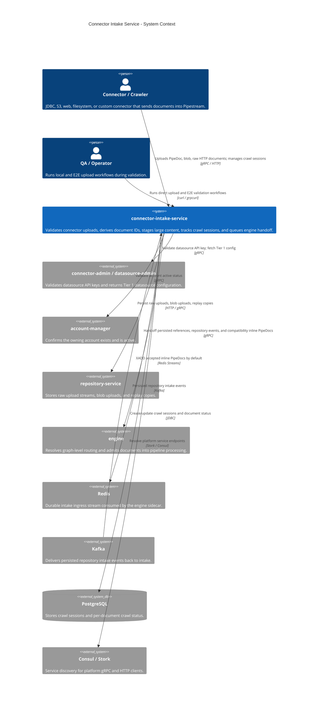
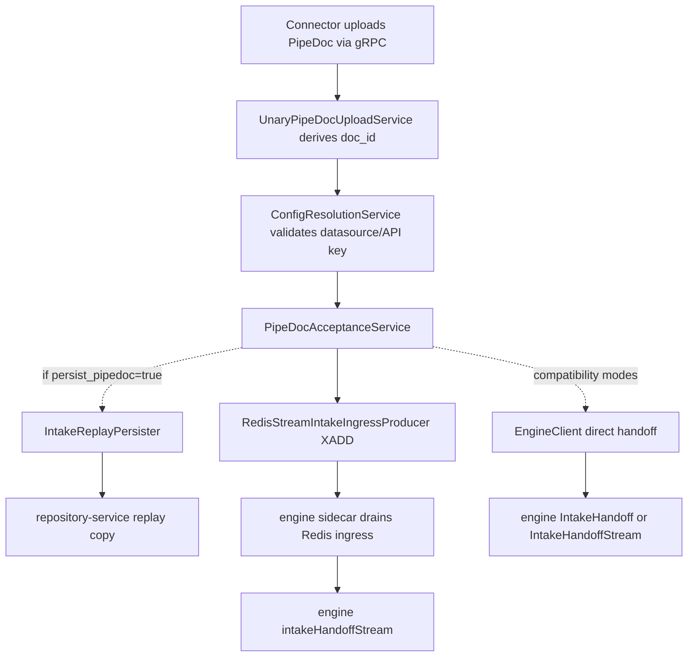
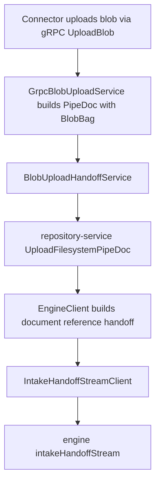
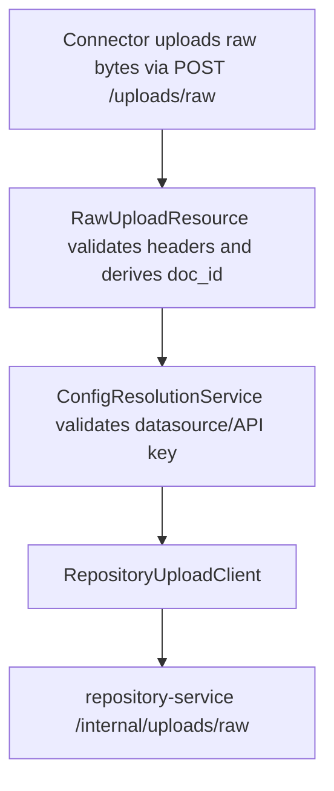

# Connector Intake Service C4 Diagrams

This document describes `connector-intake-service` using C4-style Mermaid diagrams.

`connector-intake-service` is the graph-agnostic front door for documents entering Pipestream. It validates connector credentials, derives deterministic document IDs, accepts HTTP and gRPC uploads, records crawl-session state, and hands accepted work toward engine processing.

## Level 1: System Context

## Level 2: Container View

```mermaid
C4Container
    title Connector Intake Service - Container View

    Person(connector, "Connector / Crawler", "External document producer.")
    Person(qa, "QA / Operator", "Runs upload and crawl validation workflows.")

    System_Boundary(intakeBoundary, "connector-intake-service") {
        Container(grpcApi, "gRPC API", "Quarkus gRPC", "ConnectorIntakeService RPCs: UploadPipeDoc, UploadBlob, UploadPipeDocStream, crawl session RPCs.")
        Container(httpApi, "HTTP Upload API", "Quarkus REST", "POST /uploads/raw for large raw binary uploads.")
        Container(uploadServices, "Upload Application Services", "Java / CDI", "Validates requests, derives doc IDs, stamps ownership, enqueues inline docs, persists blobs.")
        Container(sessionServices, "Crawl Session Services", "Java / CDI / Panache", "Starts, ends, heartbeats, and tracks crawl sessions.")
        Container(repoEventConsumer, "Repository Event Consumer", "SmallRye Messaging / Kafka", "Receives repository intake events and hands persisted references to engine.")
        Container(redisProducer, "Redis Ingress Producer", "Quarkus Redis", "Serializes engine handoff requests into Redis Stream fields.")
        Container(engineClient, "Engine Handoff Client", "gRPC client", "Calls engine by unary compatibility RPC or long-lived intakeHandoffStream.")
        Container(validationClient, "Validation Clients", "gRPC clients", "Calls datasource-admin and account-manager.")
        Container(repositoryClient, "Repository Clients", "HTTP REST client / gRPC clients", "Streams raw bodies and persists PipeDocs/blob documents.")
    }

    System_Ext(connectorAdmin, "connector-admin / datasource-admin", "API key and datasource configuration service.")
    System_Ext(accountManager, "account-manager", "Account status service.")
    System_Ext(repository, "repository-service", "Document and blob persistence service.")
    System_Ext(engine, "engine", "Pipeline admission and graph routing service.")
    System_Ext(redis, "Redis", "Durable intake ingress stream.")
    System_Ext(kafka, "Kafka", "Repository event transport.")
    SystemDb_Ext(postgres, "PostgreSQL", "Crawl session database.")

    Rel(connector, grpcApi, "Uploads PipeDoc/blob streams and crawl-session RPCs", "gRPC")
    Rel(connector, httpApi, "Uploads raw file bytes", "HTTP")
    Rel(qa, grpcApi, "Validates direct gRPC uploads", "grpcurl")
    Rel(qa, httpApi, "Validates raw upload path", "curl")

    Rel(grpcApi, uploadServices, "Delegates upload behavior")
    Rel(grpcApi, sessionServices, "Delegates crawl-session behavior")
    Rel(httpApi, validationClient, "Validates datasource/API key")
    Rel(httpApi, repositoryClient, "Proxies raw upload body")

    Rel(uploadServices, validationClient, "Resolve Tier 1 config")
    Rel(uploadServices, redisProducer, "Enqueue accepted inline PipeDocs")
    Rel(uploadServices, repositoryClient, "Persist blob uploads and replay copies")
    Rel(uploadServices, engineClient, "Handoff persisted blob references")
    Rel(sessionServices, postgres, "Persist crawl session state", "JDBC")
    Rel(repoEventConsumer, engineClient, "Handoff repository event references")

    Rel(validationClient, connectorAdmin, "Validate API key", "gRPC")
    Rel(validationClient, accountManager, "Check account active", "gRPC")
    Rel(repositoryClient, repository, "Persist/fetch documents and raw bytes", "HTTP / gRPC")
    Rel(redisProducer, redis, "XADD intake ingress envelope", "Redis Streams")
    Rel(engineClient, engine, "intakeHandoffStream", "gRPC bidi")
    Rel(kafka, repoEventConsumer, "intake-repo-events-in", "Kafka")
```

## Level 3: Component View

```mermaid
C4Component
    title Connector Intake Service - Component View

    Container_Boundary(intakeService, "connector-intake-service") {
        Component(connectorApi, "ConnectorIntakeServiceImpl", "gRPC adapter", "Thin transport adapter for ConnectorIntakeService RPCs.")
        Component(unaryUpload, "UnaryPipeDocUploadService", "Application service", "Validates UploadPipeDoc, derives doc_id, resolves config, and accepts PipeDoc.")
        Component(streamingUpload, "StreamingPipeDocUploadService", "Application service", "Opens bidi UploadPipeDocStream observers.")
        Component(streamingObserver, "StreamingPipeDocObserver", "Stream observer", "Serializes stream messages, handles flow control/cancellation, validates context-before-items.")
        Component(blobUpload, "GrpcBlobUploadService", "Application service", "Builds PipeDoc from UploadBlobRequest bytes and metadata.")
        Component(rawUpload, "RawUploadResource", "HTTP resource", "Validates raw upload headers and streams body to repository-service.")
        Component(acceptance, "PipeDocAcceptanceService", "Application service", "Routes inline PipeDocs to Redis by default, or direct engine compatibility handoff, and optionally schedules replay persistence.")
        Component(blobHandoff, "BlobUploadHandoffService", "Application service", "Persists blob PipeDoc to repository and hands off document reference to engine.")
        Component(replayPersister, "IntakeReplayPersister", "Background worker", "Fire-and-forget durable replay copy for persisted gRPC PipeDocs.")
        Component(docIdDeriver, "PipeDocIdDeriver", "Domain helper", "Derives deterministic doc IDs from client doc_id, source_doc_id, source_uri, or source_path.")
        Component(configResolver, "ConfigResolutionService", "Application service", "Builds Tier 1 resolved ingestion config.")
        Component(validation, "ConnectorValidationService", "gRPC client facade", "Validates datasource API key and account status.")
        Component(redisIngress, "RedisStreamIntakeIngressProducer", "Redis producer", "Writes IntakeIngressEnvelope to Redis Streams.")
        Component(engineClient, "EngineClient", "Engine facade", "Builds PipeStream/IntakeHandoffRequest wrappers.")
        Component(streamClient, "IntakeHandoffStreamClient", "gRPC bidi client", "Maintains long-lived stream to engine, correlates handoff IDs to acks.")
        Component(repoEvents, "IntakeRepoEventConsumer", "Kafka consumer", "Converts repository events into engine reference handoffs.")
        Component(sessionRpc, "CrawlSessionRpcService", "gRPC application service", "Validates crawl-session RPCs and delegates to SessionManager.")
        Component(sessionManager, "SessionManager", "Domain service", "Creates, completes, fails, heartbeats, and cleans up crawl sessions.")
        Component(sessionRepo, "CrawlSessionRepository", "Panache repository", "Persists CrawlSession entities.")
        Component(documentRepo, "CrawlDocumentRepository", "Panache repository", "Persists per-document crawl status.")
        Component(repoUploadClient, "RepositoryUploadClient", "HTTP client facade", "Streams raw upload bodies to repository-service.")
        Component(repoGrpcClients, "Repository gRPC clients", "gRPC client stubs", "UploadFilesystemPipeDoc and repository filesystem calls.")
    }

    System_Ext(connectorAdmin, "connector-admin / datasource-admin", "Datasource validation.")
    System_Ext(accountManager, "account-manager", "Account validation.")
    System_Ext(repository, "repository-service", "Document persistence.")
    System_Ext(engine, "engine", "Pipeline admission.")
    System_Ext(redis, "Redis", "Intake ingress stream.")
    System_Ext(kafka, "Kafka", "Repository events.")
    SystemDb_Ext(postgres, "PostgreSQL", "Crawl session storage.")

    Rel(connectorApi, unaryUpload, "Delegates UploadPipeDoc")
    Rel(connectorApi, blobUpload, "Delegates UploadBlob")
    Rel(connectorApi, streamingUpload, "Opens UploadPipeDocStream")
    Rel(connectorApi, sessionRpc, "Delegates crawl session RPCs")
    Rel(streamingUpload, streamingObserver, "Creates observer")

    Rel(unaryUpload, docIdDeriver, "Derive deterministic doc_id")
    Rel(unaryUpload, configResolver, "Resolve Tier 1 config")
    Rel(unaryUpload, acceptance, "Accept PipeDoc")
    Rel(streamingObserver, configResolver, "Resolve stream context")
    Rel(streamingObserver, acceptance, "Accept each PipeDocItem")
    Rel(blobUpload, docIdDeriver, "Derive blob doc_id")
    Rel(blobUpload, configResolver, "Resolve Tier 1 config")
    Rel(blobUpload, blobHandoff, "Persist and handoff")

    Rel(acceptance, redisIngress, "Enqueue inline handoff")
    Rel(acceptance, replayPersister, "Schedule replay copy when enabled")
    Rel(redisIngress, redis, "XADD")
    Rel(replayPersister, repoGrpcClients, "UploadFilesystemPipeDoc")
    Rel(blobHandoff, repoGrpcClients, "UploadFilesystemPipeDoc")
    Rel(blobHandoff, engineClient, "Handoff document reference")
    Rel(engineClient, streamClient, "Send handoff request")
    Rel(streamClient, engine, "intakeHandoffStream")

    Rel(rawUpload, configResolver, "Resolve config")
    Rel(rawUpload, repoUploadClient, "Proxy body")
    Rel(repoUploadClient, repository, "POST /internal/uploads/raw")
    Rel(repoGrpcClients, repository, "Repository gRPC")

    Rel(configResolver, validation, "Validate datasource and account")
    Rel(validation, connectorAdmin, "ValidateApiKey")
    Rel(validation, accountManager, "GetAccount")

    Rel(repoEvents, kafka, "Consumes intake-repo-events-in")
    Rel(repoEvents, engineClient, "Handoff persisted reference")

    Rel(sessionRpc, sessionManager, "Manage sessions")
    Rel(sessionManager, sessionRepo, "CRUD CrawlSession")
    Rel(sessionManager, documentRepo, "Track crawl documents")
    Rel(sessionRepo, postgres, "JDBC")
    Rel(documentRepo, postgres, "JDBC")
```

## Main Data Flows

